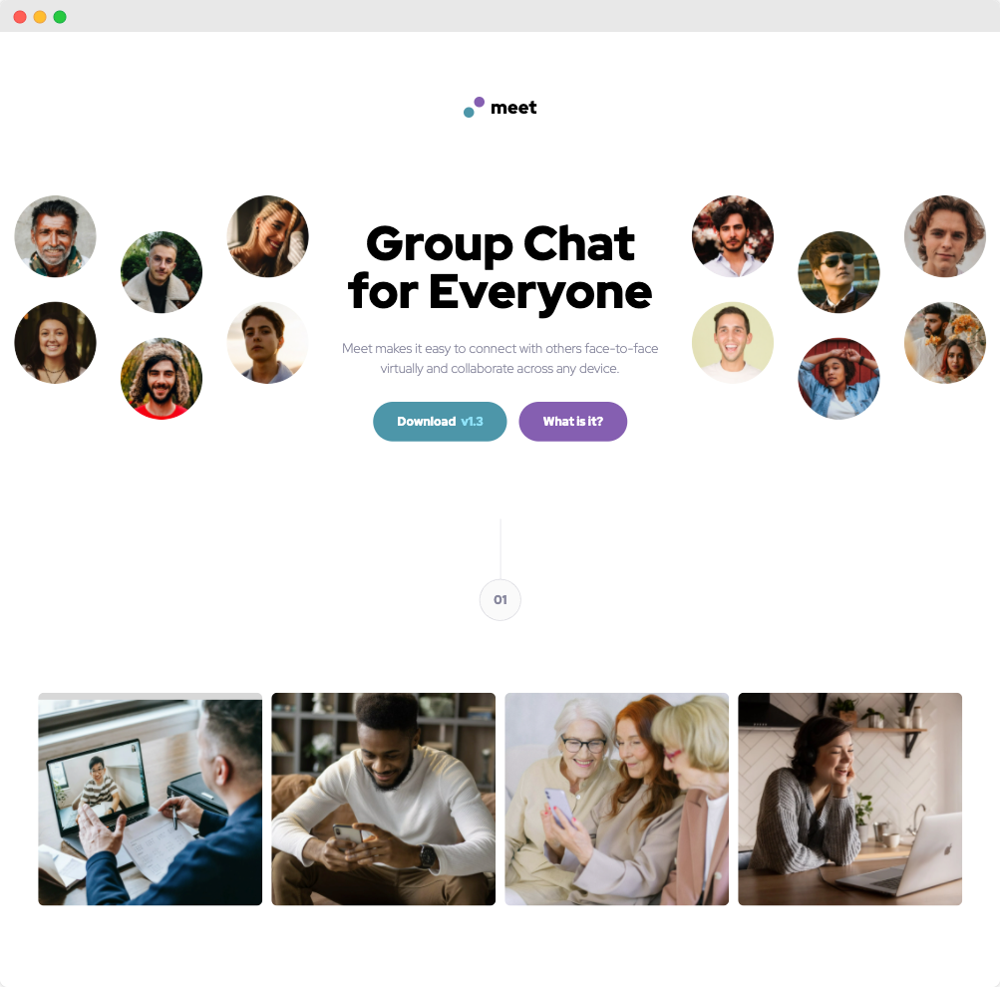

# FrontendMentor Challenge | Meet Landing Page Challenge Hub

This is a challenge from FrontendMentor.   
You can find the description of the task here:  
https://www.frontendmentor.io/challenges/meet-landing-page-rbTDS6OUR



### Goals
My goal in this challenge was to:
- get up and running with [GSAP Greensock](https://greensock.com/gsap/);
- find a way to only show the animation once per day

### Acknowledgments
I would like to thank [ApplePieGiraffe](https://www.frontendmentor.io/profile/ApplePieGiraffe) - he inspired me to touch GSAP with his [excellent solution](https://meet-landing-page-apg.vercel.app/).

### How to run
```bash
git clone https://github.com/jeromehaas/meet-landing-page-challenge-hub-fm
cd meet-landing-page-challenge-hub-fm
nvm use
npm install 
npm start
```